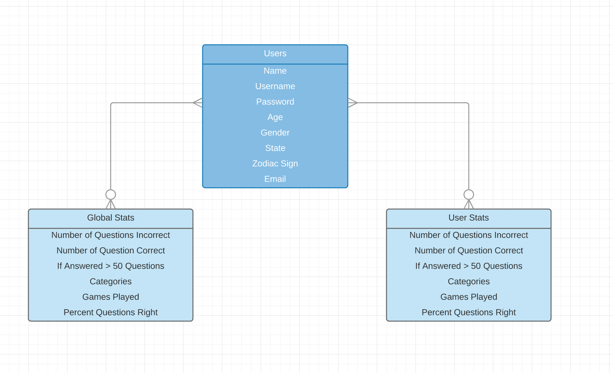
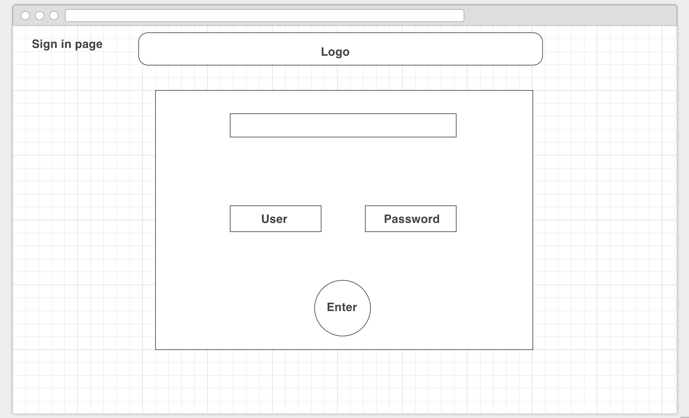
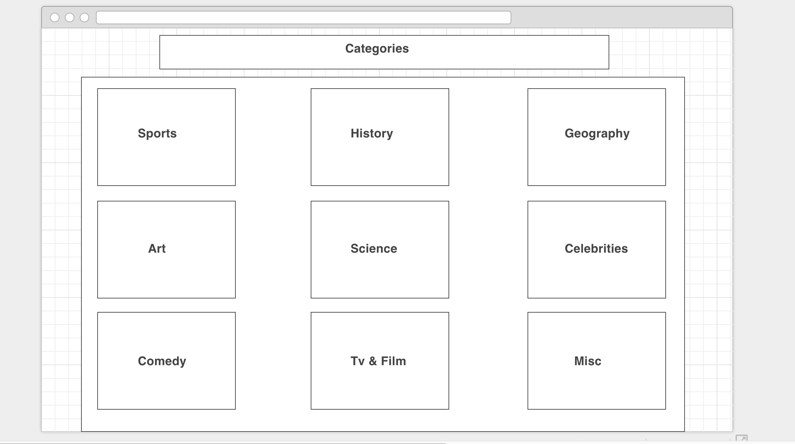
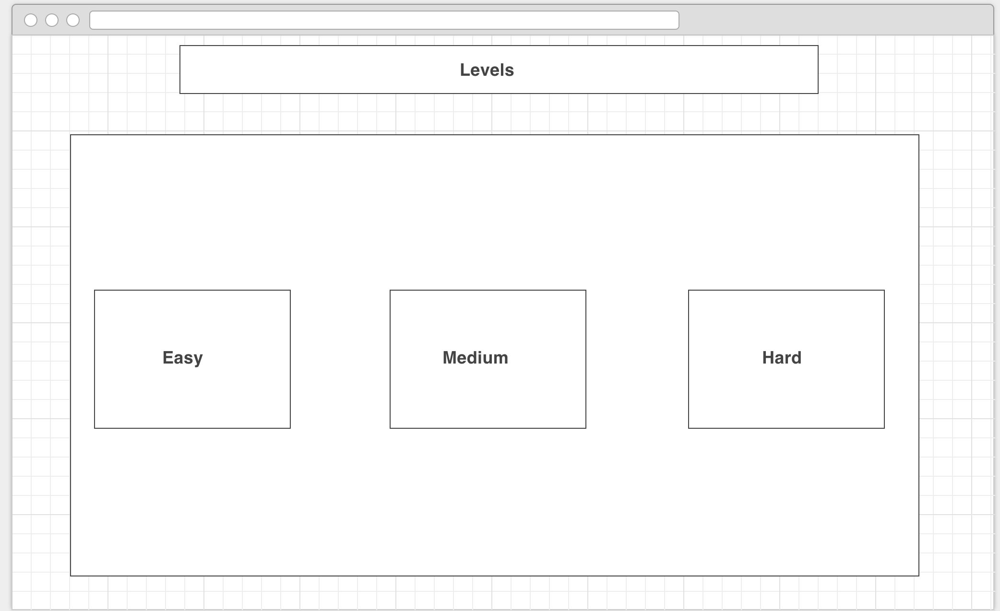
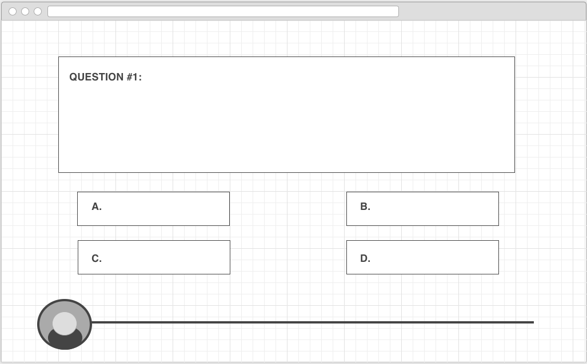
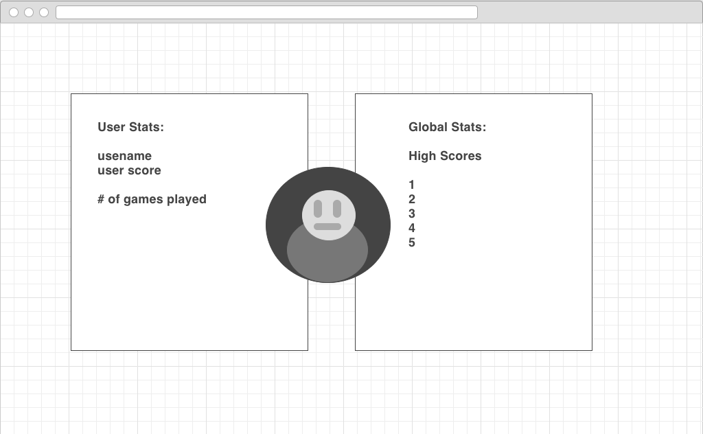

# RobotRivalry

Technologies Used:
Node.js
Express
REACT.js
PSQL
Webpack
Babel
HTML
CSS
Javascript

Approach:
Robot Rivalry is a trivia game that takes place in a futuristic robotic themed world. We will be using Open Trivia Database (https://opentdb.com/api_config.php) for trivia questions.
A unique robot avatar will be assigned to the player using the Robothash API (https://robohash.org)
Player is given a category of topics to choose from and a level of easy, medium, and hard.
There are 10 questions to answer per round, when a question is answered correctly, the avatar button on the bottom moves closer to the finish line.
After each round, show a User and Global scoreboard.

Installation instructions for any Dependencies:
-npm install -to install all dependencies from the json file
-npm install webpack -installs webpack server

ERDs - Diagrams of your models and their relationships:

*add in 2nd model - tracking finished games / categories / win rate

User Stories:
Signing Up and Logging In
Robot Rivals is a single player robotic trivia game. When the client lands on the home page, she will be asked to either sign up or log-in. If the client does not have an account, she will first create one by signing up. 

To sign up, the user will enter the following information: name, password, email, gender, age, state of residence, and zodiac sign. Upon entering this information, the server will send a fetch call to the Robot Profile generator (https://robohash.org/), to generate a random robot profile picture that will be saved to the account. Once this is complete, the user information will be saved to the database.

The user then can log into the application. Upon login, the user will be able to start a new game, view their profile, or see game statistics.

Playing the game
After the user selects “New Game”, the user will be transferred to the category selection screen where she will select which category of questions she would like to answer. After this, the user will be directed to the next screen where she will have to choose her difficulty level (easy, medium, hard or variety). The user will then be directed to the game page.

On the game page, the Robot Overlord will welcome the user to New New York, year 3016. The user will have to answer “old time” trivia based on millenniums passed and the extinct human race. After the welcome message is displayed, a series of ten questions will be asked. The Robot Overload will ask multiple choice questions one at a time. If the user answers the question correctly, her robot image will be moved forward one tick across our Escape from Robot Hell Timeline. Once all ten questions are answered, the game will end with a notification corresponding to how far the user moved her robot profile. After the notification, the user will be redirected to the home login page.

Viewing statistics
After clicking on the statistics page, the user will see  statistics related to the global community of players and her own individual statistics. Global statistics will include a leaderboard of top ranked players (based on all users who’ve played more than 10 games), and the total number of questions answered (broken down by correct / incorrect). Player statistics will show their answer success rate, and the number of games played.

Editing Profile
On the homepage, the user will also have a link to edit their profile. Here they will be able to update their user information like name, age, and state. They will also be able to delete their account.

Wireframes:

Descriptions of any unsolved problems or hurdles your team had to overcome:

